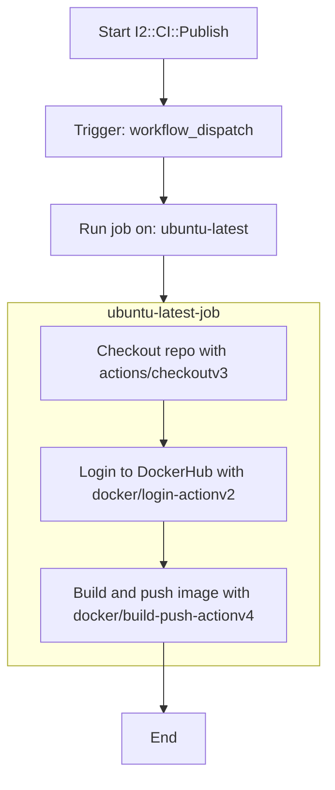

# cicd

```mermaid
graph TD

    A[Start I2::CI::Publish]
    B[Trigger: workflow_dispatch]
    C[Run job on: ubuntu-latest]
    G[End]

    subgraph ubuntu-latest-job
        D[Checkout repo with actions/checkoutv3]
        E[Login to DockerHub with docker/login-actionv2]
        F[Build and push image with docker/build-push-actionv4]
        D --> E
        E --> F
    end

    A --> B
    B --> C
    C --> ubuntu-latest-job
    F --> G

```
